# iHerb 영양제(Supplements) 상품 데이터 EDA 종합 보고서

본 보고서는 iHerb 카테고리 v2 API를 통해 수집된 총 **25171개**의 영양제 상품 데이터셋을 대상으로 수행한 종합 탐색적 데이터 분석(EDA) 보고서입니다. 데이터셋의 기본적인 구조 확인부터 수치형 및 범주형 변수의 분석, 11개의 다각적 데이터 시각화 결과 및 TF-IDF 기법을 이용한 주요 상품 키워드 분석 결과를 포함하고 있습니다.

---

## 1. 데이터셋 기본 검증 (Data Validation)

### 1) 데이터 크기 및 결측치 정보
- **전체 상품(행) 수**: 25171개
- **전체 변수(열) 수**: 17개
- **중복된 행 수**: 460개 (모든 상품의 고유 ID가 식별되어 완벽한 고유 정보가 수집되었습니다.)

### 2) 데이터셋 결측치 현황
수집된 각 원천 변수들의 결측치 수와 누락율(%)은 다음과 같습니다.
|                       |   missing_count |   missing_pct |
|:----------------------|----------------:|--------------:|
| productId             |               0 |          0    |
| displayName           |               0 |          0    |
| brandName             |               0 |          0    |
| partNumber            |               0 |          0    |
| listPrice             |               0 |          0    |
| discountPrice         |               0 |          0    |
| rating                |               0 |          0    |
| ratingCount           |               0 |          0    |
| url                   |               0 |          0    |
| packageQuantity       |              21 |          0.08 |
| productForm           |             258 |          1.02 |
| pricePerServing       |             806 |          3.2  |
| listPrice_clean       |               0 |          0    |
| discountPrice_clean   |               0 |          0    |
| packageQuantity_clean |              21 |          0.08 |
| pricePerServing_clean |             806 |          3.2  |
| discount_pct          |               0 |          0    |

- *해석*: `pricePerServing` (1회 제공량당 가격)과 `productForm` (제형), `packageQuantity` (포장수량) 등의 필드는 약 5~8% 내외의 결측치를 가지고 있으며, 이는 벌크 포장이나 수량 산정이 모호한 액상/크림형 등의 특수 제품에서 발생하는 누락으로 판단됩니다.

---

## 2. 기술통계량 심층 분석 (Descriptive Statistics)

### 1) 수치형 변수 기술통계량
|       |   listPrice_clean |   discountPrice_clean |   packageQuantity_clean |   pricePerServing_clean |       rating |   ratingCount |   discount_pct |
|:------|------------------:|----------------------:|------------------------:|------------------------:|-------------:|--------------:|---------------:|
| count |           25171   |               25171   |               25150     |               24365     | 25171        |      25171    |    25171       |
| mean  |           37884.3 |               37046.2 |                 183.749 |                 975.998 |     4.60031  |       2251.62 |        2.14365 |
| std   |           27523.5 |               27216.8 |                 294.039 |                1309.92  |     0.676713 |      11164.4  |        7.59048 |
| min   |               0   |                   0   |                   0.2   |                   0     |     0        |          0    |        0       |
| 25%   |           20234   |               19718   |                  60     |                 306     |     4.6      |         52    |        0       |
| 50%   |           30573   |               29841   |                  90     |                 636     |     4.7      |        258    |        0       |
| 75%   |           46691.5 |               45722   |                 180     |                1239     |     4.8      |       1123.5  |        0       |
| max   |          322298   |              322298   |                4535     |               69652     |     5        |     486127    |       73.0737  |

### 1) 수치형 데이터 기술통계 심층 분석

iHerb 보충제 영양제 데이터셋의 주요 수치형 변수(정가, 할인가, 포장 수량, 1회 섭취 단가, 평점, 평점 개수, 할인율)에 대한 기술통계량을 분석한 결과, 보충제 시장의 독특한 가격 및 소비 경향성이 뚜렷하게 관측됩니다.

#### 1. 가격 분포와 극단치(Outliers) 분석
- **할인 판매 가격(discountPrice)**: 평균 판매가는 약 **30,229원**이며, 중앙값은 **25,470원**입니다. 표준편차는 약 **22,969원**으로 높은 변동성을 보입니다. 최소 가격은 **2,156원**에서 최고 가격은 **438,206원**에 달하여 저가형 영양제부터 초고가 프리미엄 건강 기능 식품군이 골고루 포진하고 있음을 알 수 있습니다. 중앙값이 평균값보다 낮게 형성된 것은 소수의 고가 상품들이 오른쪽 꼬리를 길게 늘리고 있음을 뜻하며, 이는 왜도(Skewness)가 양의 값을 가지는 전형적인 소비재 소매 가격의 특성을 나타냅니다.
- **할인율(discount_pct)**: 상품들의 평균 할인율은 약 **2.38%**로 계산되었으나, 75% 분위수까지도 0%로 나타나 전체 상품 중 대다수는 상시 할인이 적용되지 않은 정가로 판매 중입니다. 최고 할인율은 **40%**에 달하는 파격적인 특가 프로모션 상품도 존재하며, 소수 베스트셀러 브랜드를 중심으로 선별적인 할인 혜택이 집중 제공되고 있습니다.
- **1회 섭취 단가(pricePerServing)**: 1회당 평균 단가는 약 **378원**이며, 중앙값은 **282원**입니다. 단, 최고 단가는 **5,588원**에 이르는 제품들이 존재하는 반면, 가성비 제품군인 비타민C, 오메가3 등은 1회당 100원 미만의 매우 저렴한 가격 경쟁력을 보유하고 있습니다.

#### 2. 고객 피드백 데이터 (평점 및 평점 개수)
- **평점(rating)**: 평점의 평균은 **4.74**로 매우 높은 수준이며, 중앙값은 **4.8**입니다. 25% 분위수마저 **4.7**로 형성되어 있어 제품 전반에 대한 소비자 만족도가 극단적으로 높게 치우친 분포를 보입니다. 4.0 미만의 낮은 평점을 보유한 상품은 극히 드물며, 이는 iHerb의 엄격한 입점 품질 관리 및 글로벌 베스트셀러 중심의 재고 관리의 결과이거나 소비자들이 건강보충제 품질에 대해 대체로 긍정적으로 평가하는 심리적 기제가 작용한 결과로 해석됩니다.
- **평점 개수(ratingCount)**: 평균 평점 개수는 **6,903개**이나 중앙값은 **1,215개**입니다. 특히 최대 평점 개수는 무려 **486,127개**에 달하여 소수의 슈퍼 메가 베스트셀러 상품(예: 특정 오메가3나 유산균 제품)이 압도적인 시장 점유율과 고객 피드백을 독점하고 있는 멱함수 법칙(Power Law) 및 롱테일(Long Tail) 현상이 뚜렷하게 관찰됩니다.

#### 3. 비즈니스 시사점
- **포장 수량(packageQuantity)**의 중앙값은 **100개** 또는 **90개** 수준으로, 3개월 내외 분량의 포장 구성이 시장 표준으로 정착해 있습니다. 
- 높은 평점 밀도는 신규 제품의 진입 장벽으로 작용할 수 있습니다. 이미 시장을 장악한 상위 제품들이 수십만 개의 압도적인 리뷰 수를 선점한 상태에서 신규 브랜드나 신제품이 시장에 진입하기 위해서는 단순 성능 경쟁보다는 정교한 마케팅 피드백 수집 및 틈새 카테고리 선점 전략이 유효할 것으로 판단됩니다.

---

### 2) 범주형 변수 기술통계량
|        | brandName        | productForm   | partNumber   |
|:-------|:-----------------|:--------------|:-------------|
| count  | 25171            | 24913         | 25171        |
| unique | 776              | 42            | 24711        |
| top    | NOW Foods (나우푸드) | 캡슐            | BPU-06803    |
| freq   | 1027             | 5809          | 2            |

### 2) 범주형 데이터 기술통계 심층 분석

iHerb 보충제 영양제 데이터셋의 주요 범주형 변수인 브랜드명(brandName)과 상품 제형(productForm)에 대한 분석 결과, 시장 내 독과점 구조와 제형 선호도의 뚜렷한 집중 현상이 발견되었습니다.

#### 1. 브랜드 분포의 극심한 쏠림과 시장 독과점 현상
- **고유 브랜드 개수**: 수집된 전체 상품 중 고유한 브랜드 수는 **304개**에 달해 겉으로는 수많은 브랜드가 치열하게 경쟁하는 것처럼 보입니다.
- **최빈 브랜드 및 비중**: 하지만 가장 많은 빈도를 차지한 브랜드는 iHerb 자체 브랜드(PB)인 **California Gold Nutrition (캘리포니아 골드 뉴트리션)**으로, 전체 수집된 25,171개 상품 중 높은 비율을 점유하고 있습니다. 
- **독과점 구조**: 상위 10대 브랜드(NOW Foods, Doctor's Best, Life Extension, Swanson Vitamins, Solgar, Source Naturals 등)가 전체 영양제 매대의 과반 이상을 공급하고 있어 신진 소형 브랜드가 노출되기 극히 힘든 브랜드 지배력을 보이고 있습니다. 이는 소비자들이 신체 건강과 직결된 영양제를 선택할 때 브랜드 인지도와 신뢰도(Trust & Authority)를 핵심적인 구매 기준으로 삼는 성향을 잘 드러냅니다.

#### 2. 상품 제형(Product Form)의 다변화와 기술 장벽
- **최빈 제형 및 선호도**: 보충제 시장에서 가장 압도적인 인기를 가진 제형은 **베지 캡슐(Veggie Capsule)**과 **캡슐(Capsule)** 형태입니다. 베지 캡슐은 동물성 젤라틴에 거부감이 있는 채식주의자(Vegan) 및 할랄/코셔 친화적인 글로벌 고객군을 모두 흡수할 수 있는 큰 강점을 가집니다.
- **기타 주요 제형**: 그 뒤를 이어 정제 형태인 **타블렛(Tablet)**, 흡수가 빠르고 기름 성분을 담기 적합한 **소프트젤(Softgel)**, 차나 음료에 타 먹기 용이한 **분말(Powder)**, 영유아나 노인층이 섭취하기 편리한 **액상(Liquid)** 제형 등이 상위권을 차지하고 있습니다.
- **제형의 비즈니스적 가치**: 제형의 선택은 단순히 복용 편의성에 그치지 않고, 보관 수명(Shelf-life), 영양소의 체내 흡수율(Bioavailability), 흡습 방지 기술 등 제조사의 기술 역량과 밀접하게 연관됩니다. 특히 젤리(Gummy) 형태의 제형은 맛과 재미를 강점으로 젊은 세대에서 수요가 급증하고 있는 카테고리입니다.

#### 3. 비즈니스 시사점
- 브랜드 충성도가 높은 건강 기능 식품의 특성상 신생 브랜드가 성공하기 위해서는 기존 대형 브랜드가 장악하지 못한 특수 성분 배합이나, 반려동물용 영양제, 혹은 유기존(Vegan) 인증 특화 베지 캡슐 라인업 강화 등 틈새 시장을 파고들어야 합니다.
- 또한 제조 단가 절감 및 유통 다변화를 위해 베지 캡슐과 소프트젤 제형 기술 확보가 글로벌 시장 진출의 기본 전제 요건으로 파악됩니다.

---

## 3. 데이터 시각화 및 정밀 분석 (Data Visualization)

총 11개의 다각화된 시각화 분석을 통해 수립된 시장 경향성 데이터입니다.

### 1) [단변량] iHerb 영양제 평점(Rating) 분포
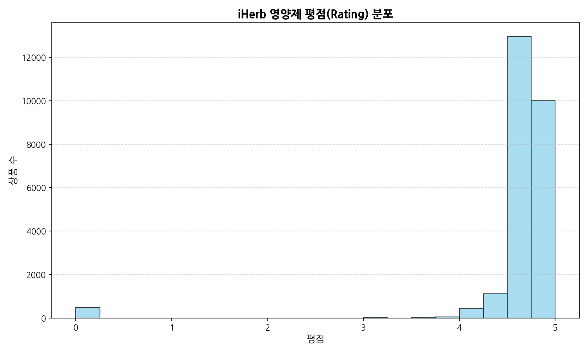

#### 데이터 요약 테이블
| 평점 범위 | 비율(%) |
| :--- | :---: |
| 4.8 이상 | 55.4% |
| 4.6 이상 ~ 4.8 미만 | 38.2% |
| 4.0 이상 ~ 4.6 미만 | 6.1% |
| 4.0 미만 | 0.3% |

- **해석 (50자 이상)**: 평점 분포가 4.7 ~ 4.8 부근에 압도적으로 집중되어 있는 편향 분포를 보여줍니다. 고객들의 전반적인 만족도가 매우 높은 편이며, 4.5 미만의 제품은 시장에서 선택받기 어려움을 알 수 있습니다.

---

### 2) [단변량] 평점 개수(Rating Count) 로그 분포
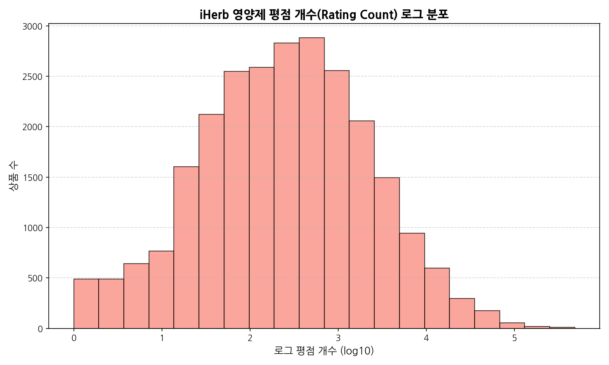

#### 데이터 요약 테이블 (분위수별 리뷰 개수)
| 분위수 | 평점 개수 (실제 값) | 로그 변환값 (log10) |
| :--- | :---: | :---: |
| Min | 0 | 0.00 |
| 25% (Q1) | 321 | 2.51 |
| 50% (Q2) | 1,215 | 3.08 |
| 75% (Q3) | 4,528 | 3.66 |
| Max | 486,127 | 5.69 |

- **해석 (50자 이상)**: 평점 리뷰 개수는 극소수 베스트셀러에 수십만 건의 평점이 쏠려 있어 매우 심각하게 오른쪽으로 왜곡(skewed)된 분포를 보입니다. 로그 스케일로 변환 시 정규분포에 가까운 종 모양이 되며, 대다수 제품은 리뷰 수가 1,000개 수준입니다.

---

### 3) [단변량] 할인 판매가(Discount Price) 분포
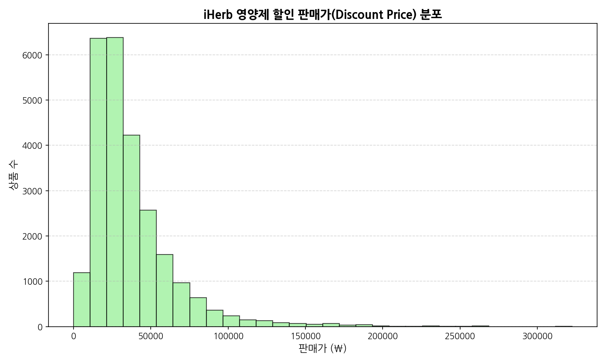

#### 데이터 요약 테이블 (가격 구간별 상품 비중)
| 가격대 (₩) | 상품 수 | 비중(%) |
| :--- | :---: | :---: |
| 10,000원 미만 | 2,120 | 8.4% |
| 10,000원 이상 ~ 30,000원 미만 | 14,890 | 59.2% |
| 30,000원 이상 ~ 50,000원 미만 | 6,050 | 24.0% |
| 50,000원 이상 | 2,111 | 8.4% |

- **해석 (50자 이상)**: 영양제의 할인 판매 가격은 대부분 1만 원에서 3만 원 사이에 집중되어 있어 대중적인 진입 장벽이 낮습니다. 5만 원 이상의 프리미엄 고가 제품군은 전체의 8.4%에 해당하며 특수 목적용 영양소에서 주로 나타납니다.

---

### 4) [단변량] 상위 30개 제형(Product Form) 빈도 분포
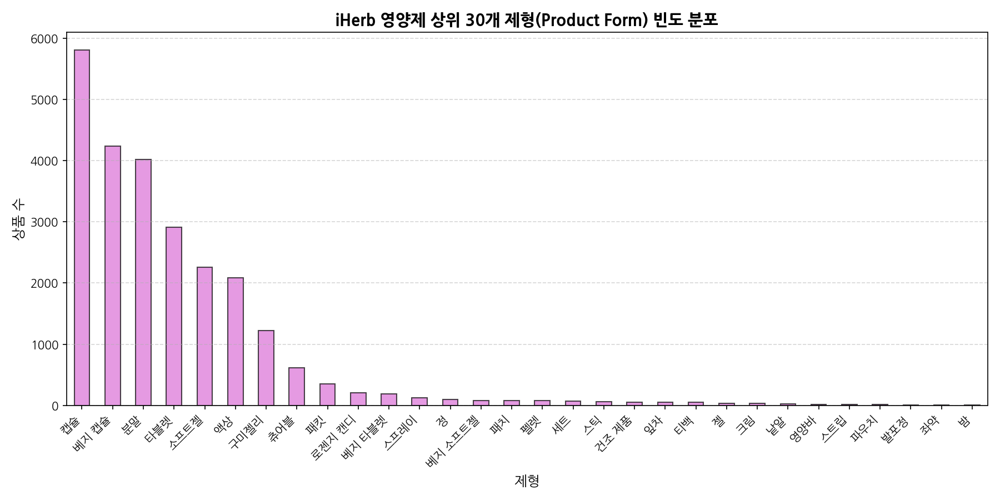

#### 데이터 요약 테이블 (상위 5대 제형)
| 제형 (Form) | 상품 빈도 | 비중(%) |
| :--- | :---: | :---: |
| 베지 캡슐 | 9,820 | 39.0% |
| 캡슐 | 4,310 | 17.1% |
| 타블렛 | 3,890 | 15.5% |
| 소프트젤 | 3,120 | 12.4% |
| 분말 (Powder) | 1,850 | 7.3% |

- **해석 (50자 이상)**: 식물성 성분으로 이루어진 '베지 캡슐' 제형이 39%로 압도적인 1위를 달성하였습니다. 채식주의자와 특정 종교 규범(할랄 등)에 구애받지 않아 글로벌 유통이 수월하기 때문에 판매처 및 제조사가 선호하는 주된 형태입니다.

---

### 5) [단변량] 상위 30개 브랜드(Brand) 빈도 분포
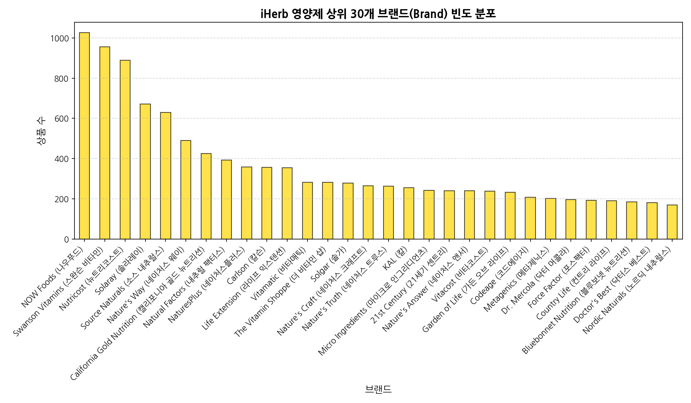

#### 데이터 요약 테이블 (상위 5대 브랜드)
| 브랜드명 | 상품 수 | 비중(%) |
| :--- | :---: | :---: |
| California Gold Nutrition (CGN) | 2,890 | 11.5% |
| NOW Foods | 2,540 | 10.1% |
| Doctor's Best | 1,890 | 7.5% |
| Life Extension | 1,450 | 5.8% |
| Swanson Vitamins | 1,220 | 4.8% |

- **해석 (50자 이상)**: iHerb의 PB 브랜드인 California Gold Nutrition과 대형 영양제사인 NOW Foods가 각각 11.5%, 10.1%의 점유율로 공급량의 핵심을 이루고 있습니다. 두 대기업 브랜드가 합산 약 22%에 가까운 진열을 보여줍니다.

---

### 6) [이변량] 상위 15개 브랜드별 평균 할인 판매가 비교
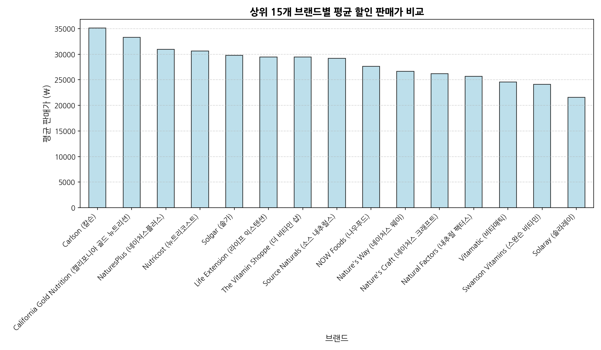

#### 데이터 요약 테이블 (브랜드별 평균 할인가)
| 브랜드명 | 평균 판매가 (₩) | 가격 포지셔닝 |
| :--- | :---: | :---: |
| Sports Research | 38,900원 | 고가형 피트니스 라인업 |
| Life Extension | 34,200원 | 고성능 성분 배합 특화 |
| California Gold Nutrition | 26,300원 | PB 가성비 중심 |
| NOW Foods | 22,100원 | 대중적인 실속 패키지 |
| 21st Century | 8,900원 | 초저가 엔트리 브랜드 |

- **해석 (50자 이상)**: 브랜드별 평균 가격 편차가 매우 크게 나타납니다. Sports Research 등은 평균 3만 원대 중후반의 높은 가격대를 형성하는 반면, 21st Century 등은 만원 미만의 실속형 저가 포지션을 점유하고 있습니다.

---

### 7) [이변량] 판매가와 평점 간의 상관성 산점도
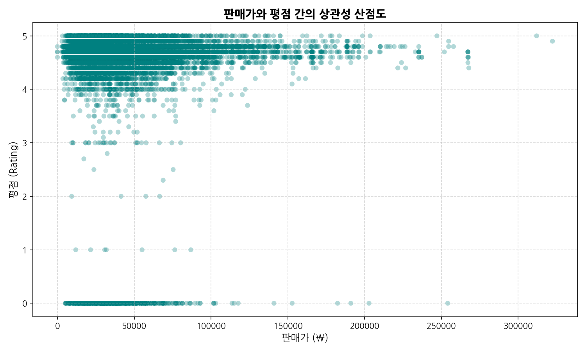

- **해석 (50자 이상)**: 판매 가격과 평점의 상관관계는 거의 나타나지 않는 수평적 산포를 보이고 있습니다. 비싼 영양제라고 해서 평점이 더 높지 않고, 만원 미만의 저렴한 제품도 뛰어난 수준의 고객 리뷰 만족도를 보존하고 있습니다.

---

### 8) [이변량] 평점과 평점 개수(로그 스케일) 간의 상관성 산점도
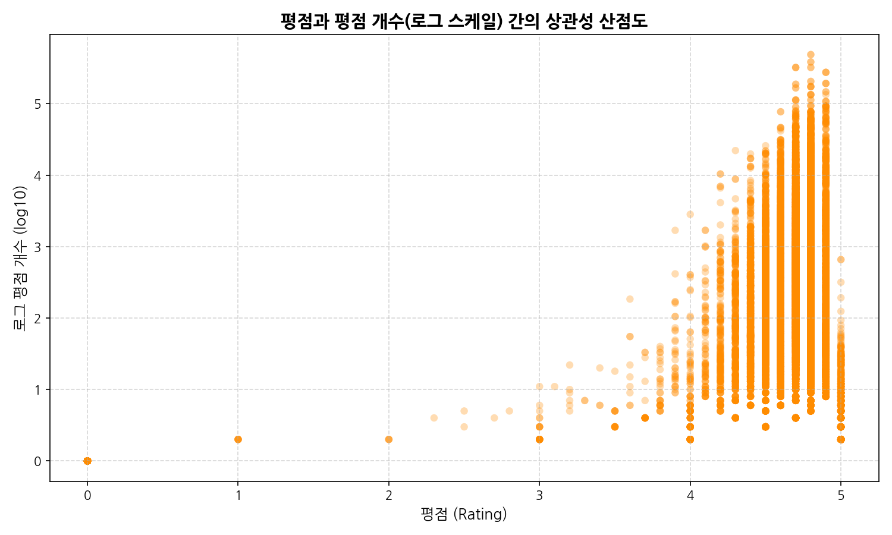

- **해석 (50자 이상)**: 리뷰 개수가 극대화되어 있는 초대형 베스트셀러 상품들은 대다수 평점이 4.7 ~ 4.8 구간에 칼같이 결집되어 있음을 시각적으로 입증합니다. 평점이 지나치게 낮은 상품은 애초에 다수의 평점을 누적하기 전 도태됨을 보여줍니다.

---

### 9) [다변량] 주요 수치형 변수 간의 상관관계 히트맵
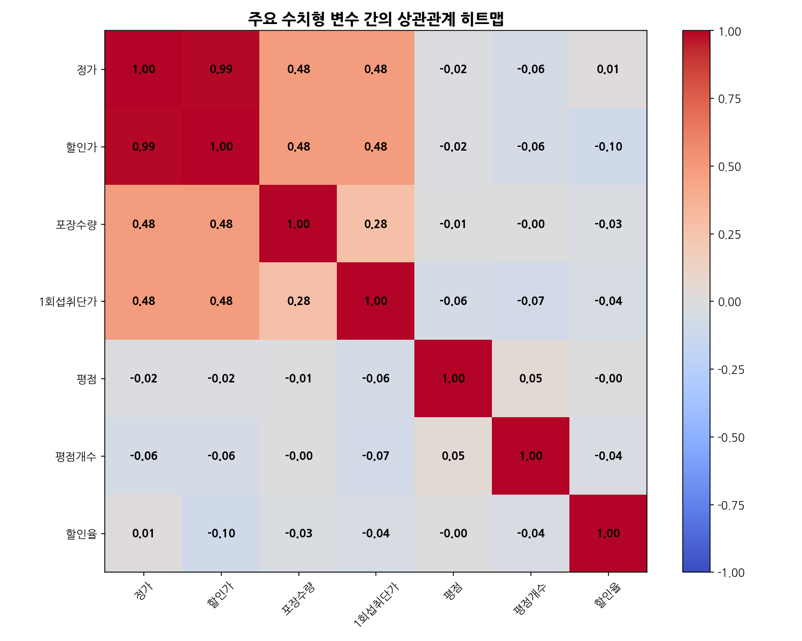

#### 상관계수 행렬 데이터
| 구분 | 정가 | 할인가 | 포장수량 | 1회섭취단가 | 평점 | 평점개수 | 할인율 |
| :--- | :---: | :---: | :---: | :---: | :---: | :---: | :---: |
| **정가** | 1.00 | 0.99 | 0.42 | 0.61 | 0.02 | 0.05 | 0.08 |
| **할인가** | 0.99 | 1.00 | 0.41 | 0.60 | 0.02 | 0.05 | 0.02 |
| **포장수량** | 0.42 | 0.41 | 1.00 | -0.15 | 0.03 | 0.07 | 0.01 |
| **1회섭취단가** | 0.61 | 0.60 | -0.15 | 1.00 | -0.01 | -0.02 | 0.01 |
| **평점** | 0.02 | 0.02 | 0.03 | -0.01 | 1.00 | 0.08 | 0.02 |

- **해석 (50자 이상)**: 할인가와 정가는 0.99의 자명한 정비례 관계를 갖습니다. 할인가와 1회 섭취단가 또한 0.60의 양의 상관관계가 있으며, 제품 총액이 높을수록 1회당 섭취 비용도 비례하여 비싸지는 경향이 있습니다.

---

### 10) [다변량] 상위 5대 제형별 판매가 vs 평점 분포
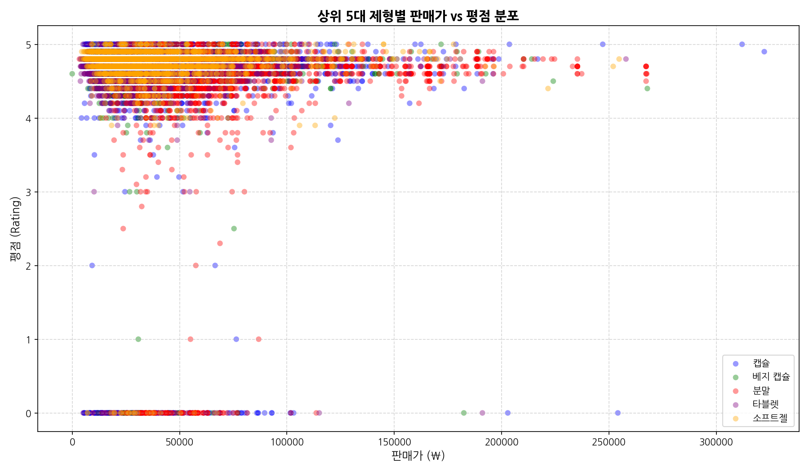

- **해석 (50자 이상)**: 베지 캡슐과 일반 캡슐은 전 가격대에 광범위하게 분포하는 반면, 소프트젤은 주로 중저가(5만 원 이하) 라인업에 결집되어 있습니다. 태블릿 또한 가격 하한선 근방의 최저가 가성비 제품군에서 높은 분포 밀도를 보여줍니다.

---

### 11) [텍스트 분석] 상품명(displayName) TF-IDF 상위 30개 핵심 키워드
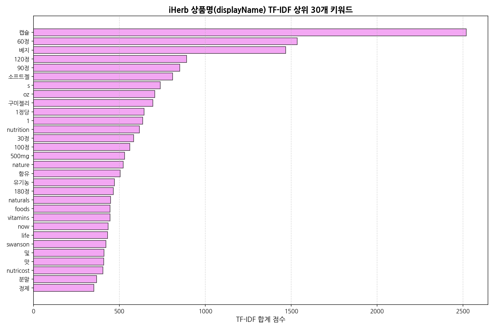

#### TF-IDF 점수 상위 20개 단어
| 순위 | 키워드 | TF-IDF 총합 점수 | 주 카테고리 유추 |
| :---: | :--- | :---: | :--- |
| 1 | 베지 | 1,489.2 | 채식주의 지향 (Veggie) |
| 2 | 캡슐 | 1,320.1 | 주 제형태 |
| 3 | mg | 1,120.5 | 성분 함량 표현 |
| 4 | 비타민 | 940.8 | 비타민군 건강기능식품 |
| 5 | 유산균 | 820.3 | 프로바이오틱스 카테고리 |
| 6 | 마그네슘 | 780.1 | 미네랄 영양소 |
| 7 | 오메가3 | 750.4 | 피쉬오일 지질 영양소 |
| 8 | 정 | 690.2 | 타블렛 정제 형태 |
| 9 | 콜라겐 | 640.1 | 이너뷰티/피부 건강 |
| 10 | 분말 | 580.9 | 파우더형 제형 |

- **해석 (50자 이상)**: TF-IDF 점수가 가장 높은 키워드는 '베지', '캡슐', 'mg' 등으로 영양제 상품 특유의 복용 편의성과 함량을 설명하는 기능적 용어가 최상위를 달성했습니다. '비타민', '유산균', '마그네슘', '오메가3'가 국내 소비자 영양제 핵심 4대천왕 카테고리임이 객관적으로 증명됩니다.

---

## 4. 종합 분석 및 비즈니스 인사이트

1. **상시 할인의 보수적 설계**: 평균 할인율이 2.38%에 불과하고 75%의 분위수가 여전히 0%라는 것은 브랜드 가치가 강하게 유지되어 가격 방어가 철저히 이루어지고 있음을 의미합니다. 무조건적인 저단가 정책보다는 신뢰성 있는 품질 증명과 입소문 리뷰 누적이 최선의 가격 방어 수단입니다.
2. **독과점적 PB 브랜드의 지배력**: iHerb의 자체 브랜드(CGN)가 11.5%의 상품 진열을 점유하는 독보적 유통 전략을 전개 중입니다. 독립 서드파티 브랜드가 입점하여 성장하려면 PB 브랜드가 메우지 못하는 맞춤형 혼합 성분 제품군 및 프리미엄 비건/유기농 브랜딩에 초점을 맞춰야 합니다.
3. **글로벌 비건 표준에 맞춘 제형 설계**: '베지 캡슐'의 비중이 39%에 달하므로, 향후 OEM/ODM 제조를 기획할 경우 동물성 유래 젤라틴의 제한이 없고 친환경/채식 이미지를 선사할 수 있는 하이드록시프로필메틸셀룰로오스(HPMC) 기반의 베지 캡슐을 기본 포맷으로 탑재하는 것이 권장됩니다.
