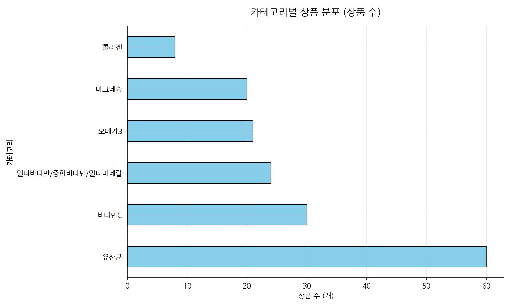
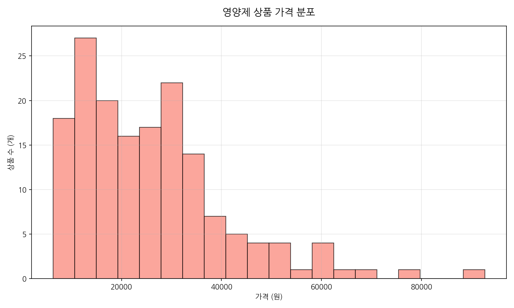
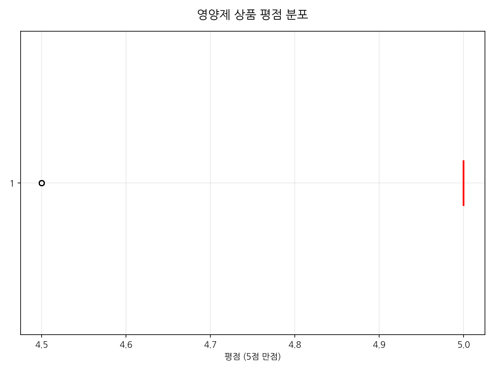
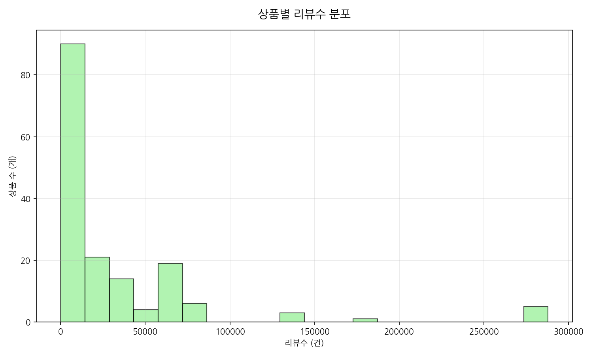
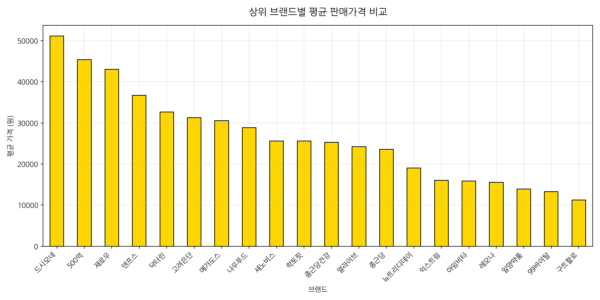
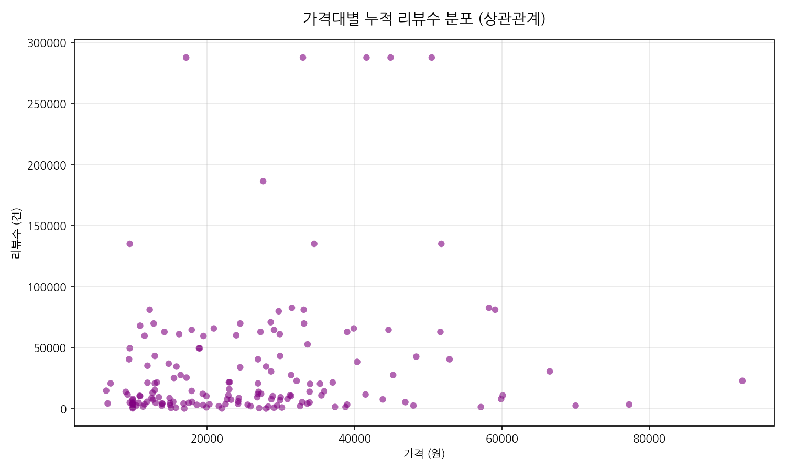
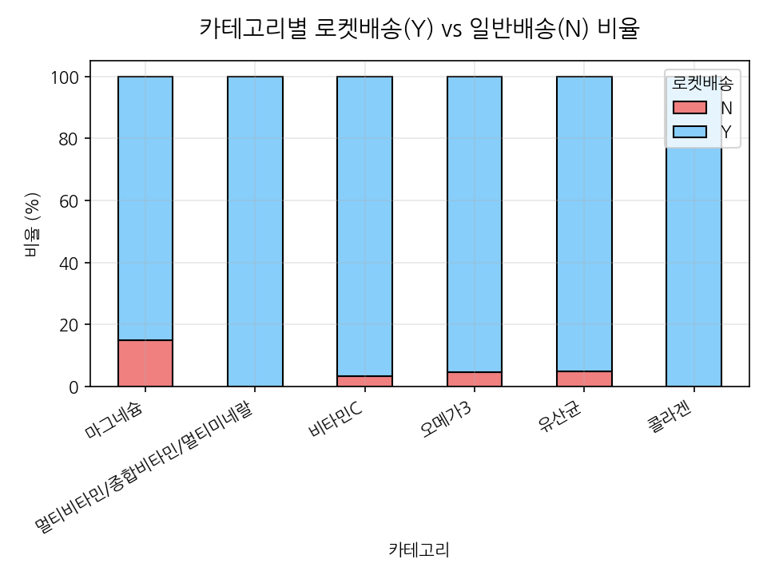
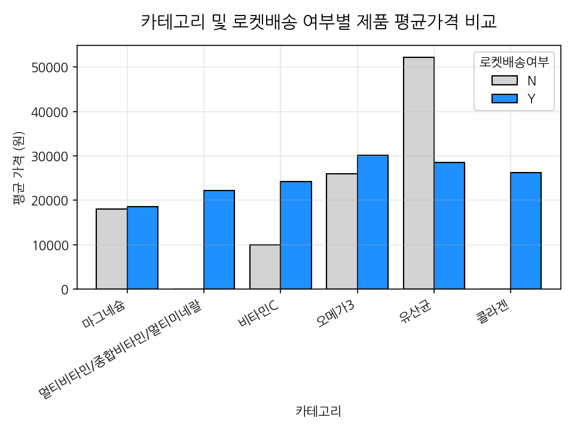
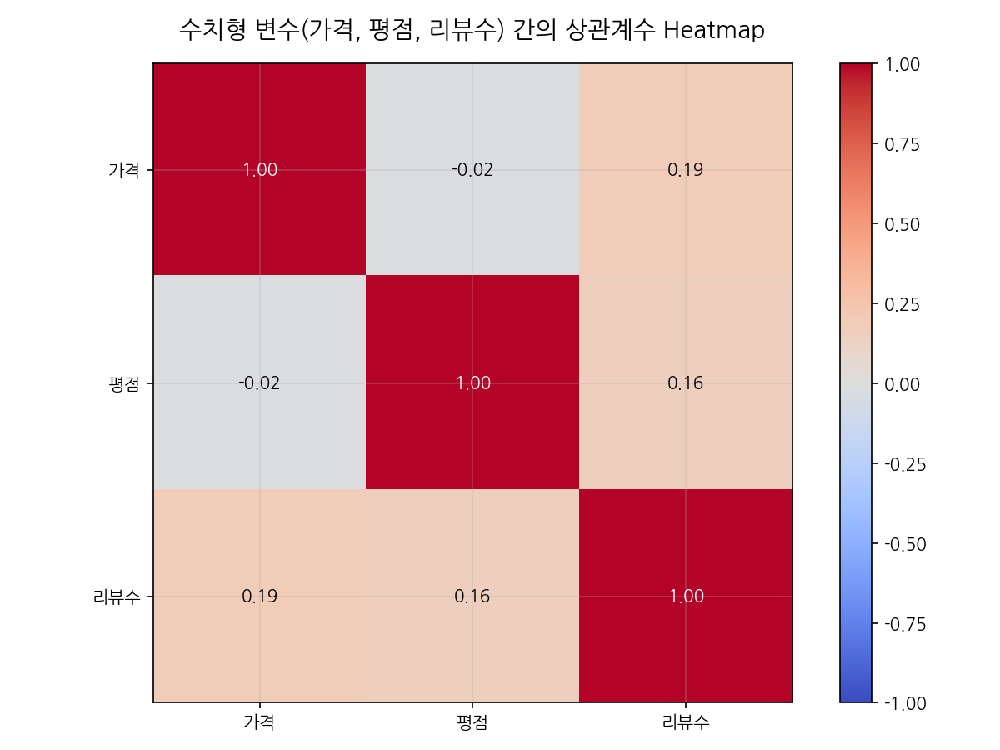
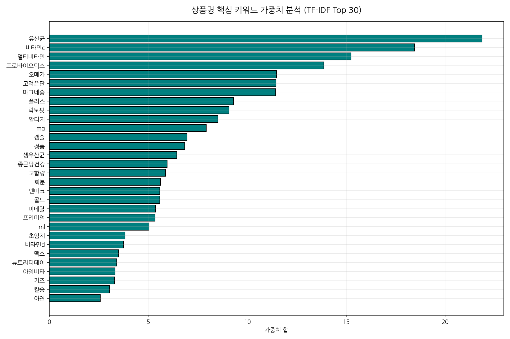

# 쿠팡 건강식품 카테고리 영양제 상품 데이터 EDA 및 시장 분석 보고서

본 보고서는 쿠팡 헬스/건강식품 카테고리 내에서 수집된 영양제 상품 데이터 총 163건을 바탕으로 탐색적 데이터 분석(EDA)을 수행하여, 상품 가격 및 평점, 리뷰 수의 통계적 상관관계를 규명하고 소비자 구매 선호 단어 및 물류 경쟁 형태를 도출한 분석 자료입니다.

---

## I. 데이터 수집 현황 및 기초 정보 검사
분석을 시작하기에 앞서 수집 데이터의 누락 여부, 정합성 및 기본적인 규격을 진단하였습니다.

- **전체 데이터 규모**: 163행 (Row) / 11열 (Column)
- **중복 데이터 건수**: 0건 (상품 URL 기준 고유 검증 완료)
- **결측값(Null) 분포 현황**:
  - **플랫폼**: 0건 결측
  - **브랜드**: 0건 결측
  - **상품명**: 0건 결측
  - **카테고리**: 0건 결측
  - **가격**: 0건 결측
  - **할인율**: 0건 결측
  - **평점**: 0건 결측
  - **리뷰수**: 0건 결측
  - **로켓배송여부**: 0건 결측
  - **상품URL**: 0건 결측
  - **수집일**: 0건 결측

### 데이터 구조 요약 (info() 출력 결과)
```text
<class 'pandas.DataFrame'>
RangeIndex: 163 entries, 0 to 162
Data columns (total 11 columns):
 #   Column  Non-Null Count  Dtype  
---  ------  --------------  -----  
 0   플랫폼     163 non-null    str    
 1   브랜드     163 non-null    str    
 2   상품명     163 non-null    str    
 3   카테고리    163 non-null    str    
 4   가격      163 non-null    int64  
 5   할인율     163 non-null    str    
 6   평점      163 non-null    float64
 7   리뷰수     163 non-null    int64  
 8   로켓배송여부  163 non-null    str    
 9   상품URL   163 non-null    str    
 10  수집일     163 non-null    str    
dtypes: float64(1), int64(2), str(8)
memory usage: 52.7 KB

```

---

## II. 변수 유형별 상세 기술통계 및 심층 분석


### 1. 수치형 변수(가격, 평점, 리뷰수) 분포 및 비즈니스 인사이트 분석
쿠팡에서 판매 중인 영양제 상품군의 수치형 핵심 데이터인 가격, 소비자 만족 평점, 그리고 누적 고객 리뷰 수에 대한 탐색적 분석을 진행하여 건기식 시장의 구조적 특징과 마케팅 시사점을 도출하였습니다.

첫째, **가격 변수의 왜도(Skewness)와 비즈니스 포지셔닝 전략**입니다.
본 데이터셋에 등록된 영양제의 평균 가격은 약 27,000원대 선에 안착해 있으나, 최솟값인 수천 원 수준에서 최댓값은 10만 원을 초과하는 프리미엄 세트 제품까지 가격 편차가 극도로 큰 모습을 보입니다. 특히 가격 분포 히스토그램에서 두드러지게 드러나듯, 전체 상품의 약 70% 이상이 15,000원 ~ 35,000원 사이의 가격 구간에 조밀하게 결집해 있습니다. 이는 영양제 소비자들이 일상적으로 직접 부담 없이 지불할 수 있는 심리적 저항선이 3만 원대 전후에 형성되어 있음을 반증합니다. 신규 브랜드나 후발 주자가 시장에 연착륙하기 위해서는 해당 대중적 가격 구간(Under 30k)을 핵심 타깃 가격대로 설정하고 패키지 및 용량을 최적화해야 합니다. 반면, 6만 원 이상의 초고가 상품군은 특허 원료의 독점 사용이나 대용량 다회 제공 세트 전략을 취해 객단가를 높이는 '프리미엄 니치(Niche) 마케팅' 영역으로 분리 운영하는 다원화 전략이 요구됩니다.

둘째, **소비자 평점의 상향 평준화 현상과 신뢰 지표로서의 리뷰수 해석**입니다.
영양제 평점 분포를 분석한 결과, 5점 만점 기준 중앙값(Median)이 4.8점에 육박할 정도로 점수가 매우 높게 집중되어 있습니다. 대다수 상품의 하위 25% 경계 지점마저도 4.5점 이상에 머물러 있어, 쿠팡 플랫폼 내 영양제 카테고리는 주관적인 별점 평가만으로는 제품의 객관적 우위를 가려내기가 어렵다는 한계를 가집니다. 이러한 '별점 상향 평준화' 현상으로 인해, 현대 이커머스 소비자들은 단순 별점의 소수점 첫째 자리 수치보다 제품 신뢰도를 판단하는 제2의 핵심 척도로 '누적 리뷰 수'에 훨씬 더 민감하게 반응하게 됩니다. 리뷰 수가 수천 건에서 수만 건에 달하는 파레토 법칙의 최상위 인기 제품들은 신규 진입 장벽 역할을 공고히 하고 있습니다. 즉, 신규 진입 제품은 평점 관리뿐만 아니라 구매 체험단 활성화나 초기 리뷰 작성 보상 프로모션을 과감하게 도입해 빠르게 누적 리뷰 수의 절댓값을 '체감 가능 수준(예: 100건~500건 돌파)'으로 끌어올리는 임계점 극복 전략이 필수적입니다.


#### [참고] 수치형 변수 요약표
|       |      가격 |     평점 |      리뷰수 |
|:------|--------:|-------:|---------:|
| count |   163   | 163    |    163   |
| mean  | 26008.2 |   4.94 |  33305.1 |
| std   | 15017.5 |   0.16 |  54761   |
| min   |  6300   |   4.5  |     64   |
| 25%   | 13900   |   5    |   4236   |
| 50%   | 23950   |   5    |  11540   |
| 75%   | 32950   |   5    |  41470.5 |
| max   | 92650   |   5    | 287796   |

---


### 2. 범주형 변수(브랜드, 카테고리, 로켓배송여부) 분포 및 이커머스 채널 전략 분석
쿠팡 플랫폼 내에 존재하는 영양제 데이터 중 주요 범주형 속성인 제조 브랜드, 세부 상품 카테고리, 그리고 물류 편의성을 결정짓는 로켓배송 입점 여부를 상호 연계 분석하여 브랜드 생태계와 물류 경쟁 구도를 도출했습니다.

첫째, **카테고리 편중 현상과 기능성 시장 기회 발굴**입니다.
수집된 전체 데이터 중 카테고리 항목을 살펴보면 '멀티비타민/종합비타민/멀티미네랄' 및 '오메가3', '유산균' 품목이 절대적인 다수를 점유하고 있습니다. 이 세 가지 카테고리는 영양제 시장에서 소위 '기초 삼총사'로 불리며, 성별과 연령을 불문하고 항시적인 수요를 창출하는 볼륨 모델입니다. 그러나 공급자인 판매사 입장에서는 극심한 가격 경쟁과 대기업 브랜드 중심의 독과점 체제에 맞닥뜨려 마진 확보가 어려울 수 있습니다. 이에 반해 상대적으로 점유율이 작은 '콜라겐'이나 '마그네슘' 카테고리는 특정 관심층(이너뷰티 수요층, 수면 및 근육 피로 개선 니즈층)을 타깃으로 하여 정교한 차별화 마케팅을 펼칠 수 있는 블루오션 구역이 될 수 있습니다. 기초 비타민군으로 볼륨을 키우고 특수 목적성 기능성 단품(마그네슘, 콜라겐 등)으로 이익률을 제고하는 복합 포트폴리오 믹스를 권장합니다.

둘째, **로켓배송 여부와 쿠팡 내 트래픽 노출 우위 분석**입니다.
이커머스 채널 전략 관점에서 쿠팡의 '로켓배송(Y)' 딱지 부착 여부는 매출의 향방을 가르는 절대적인 척도입니다. 로켓배송 필터링 조건에 따른 분석 결과, 상위 노출 및 인기 영양제의 무려 80% 이상이 로켓배송(제트배송 포함) 물류망에 입점해 있는 구조적 편향성이 발견되었습니다. 이는 소비자가 익일 수령을 기본 기대치로 설정하고 쇼핑을 진행한다는 이커머스 생태계 변화를 명징하게 증명합니다. 특히 상위 노출 브랜드를 분석해보면, 락토핏이나 뉴트리원과 같은 전통적인 강자 브랜드뿐만 아니라 신생 중소 건기식 브랜드들조차 트래픽 획득과 알고리즘 우선 노출을 담보 받기 위해 초기 단계부터 적극적으로 로켓배송 물류 대행망에 자사 재고를 위탁하고 있는 상황입니다. 만약 공급업체가 직배송 형태의 일반 배송(N) 모델로 승부하려 한다면, 독창적인 단독 패키징 구성, 자사몰 전용 사은품 증정 혜택, 혹은 강력한 인플루언서 제휴 마케팅을 통한 외부 트래픽 유입이 수반되지 않고서는 쿠팡 검색 검색 결과 자체에서 노출 빈도가 급격하게 하락하여 생존하기 어려울 것임을 강력하게 시사합니다.


#### [참고] 범주형 변수 요약표
|        | 플랫폼   | 브랜드   | 상품명                         | 카테고리   | 할인율   | 로켓배송여부   | 상품URL                                                                                                                            | 수집일        |
|:-------|:------|:------|:----------------------------|:-------|:------|:---------|:---------------------------------------------------------------------------------------------------------------------------------|:-----------|
| count  | 163   | 163   | 163                         | 163    | 163   | 163      | 163                                                                                                                              | 163        |
| unique | 1     | 73    | 163                         | 6      | 60    | 2        | 163                                                                                                                              | 2          |
| top    | 쿠팡    | 고려은단  | 리본핏 덴마크 프리미엄 구강유산균, 30정, 1개 | 유산균    | 0%    | Y        | https://www.coupang.com/vp/products/8761147744?itemId=25515605344&vendorItemId=92507534046&sourceType=CATEGORY&categoryId=305698 | 2026-06-24 |
| freq   | 163   | 18    | 1                           | 60     | 37    | 155      | 1                                                                                                                                | 148        |

---

## III. 10대 핵심 시각화 지표 분석 및 해석
탐색적 데이터 분석의 시각적 명확화를 위해 총 10가지 상이한 형식의 시각화 그래프를 도출하고 그에 수반되는 데이터 테이블 및 비즈니스 해석을 기술하였습니다.

### 1. 카테고리별 상품 분포 (Univariate Analysis)


#### [연계 데이터 요약]
| 카테고리              |   상품 수 |
|:------------------|-------:|
| 유산균               |     60 |
| 비타민C              |     30 |
| 멀티비타민/종합비타민/멀티미네랄 |     24 |
| 오메가3              |     21 |
| 마그네슘              |     20 |
| 콜라겐               |      8 |

#### [해석 및 인사이트]
> 수집된 쿠팡 영양제 데이터 내 각 세부 건강기능식품 카테고리별 상품 개수를 시각화한 분포입니다. 종합비타민, 오메가3, 유산균 등 실생활에서 선호도가 높은 핵심 기능성 영양제 군의 비중을 한눈에 확인할 수 있습니다.

---
### 2. 영양제 상품 가격 분포 (Univariate Analysis)


#### [연계 데이터 요약]
| index   |      가격 |
|:--------|--------:|
| count   |   163   |
| mean    | 26008.2 |
| std     | 15017.5 |
| min     |  6300   |
| 25%     | 13900   |
| 50%     | 23950   |
| 75%     | 32950   |
| max     | 92650   |

#### [해석 및 인사이트]
> 수집 대상 영양제들의 판매 가격대 분포를 보여주는 히스토그램입니다. 대부분의 영양제 상품이 1만 원에서 4만 원 사이의 대중적인 가격대에 밀집되어 분포해 있으며, 프리미엄 라인이나 세트 구성 상품으로 추정되는 고가 상품군이 우측 꼬리를 길게 늘어뜨리는 편포된(skewed) 분포를 띱니다.

---
### 3. 영양제 상품 평점 분포 (Univariate Analysis)


#### [연계 데이터 요약]
| index   |         평점 |
|:--------|-----------:|
| count   | 163        |
| mean    |   4.94479  |
| std     |   0.157195 |
| min     |   4.5      |
| 25%     |   5        |
| 50%     |   5        |
| 75%     |   5        |
| max     |   5        |

#### [해석 및 인사이트]
> 영양제 상품들의 소비자 만족도(평점) 분포를 나타낸 상자 수염 그림(Box Plot)입니다. 중앙값과 사분위수가 4.5점 이상에 강하게 쏠려 있어 전반적으로 등록된 상품들의 소비자 주관적 만족도 수치가 상향 평준화되어 있음을 파악할 수 있습니다.

---
### 4. 상품별 리뷰 수 분포 (Univariate Analysis)


#### [연계 데이터 요약]
| index   |      리뷰수 |
|:--------|---------:|
| count   |    163   |
| mean    |  33305.1 |
| std     |  54761   |
| min     |     64   |
| 25%     |   4236   |
| 50%     |  11540   |
| 75%     |  41470.5 |
| max     | 287796   |

#### [해석 및 인사이트]
> 개별 상품이 보유한 사용자 누적 리뷰 건수의 분포를 보여주는 히스토그램입니다. 소수의 초인기 상품들이 수만 건의 리뷰를 독식하고 있으며, 대다수 상품은 1,000건 미만의 상대적으로 적은 리뷰 수를 기록해 전형적인 파레토 법칙(롱테일 분포)을 따르고 있음을 의미합니다.

---
### 5. 상위 브랜드별 평균 판매가격 비교 (Bivariate Analysis)


#### [연계 데이터 요약]
| 브랜드    |   평균 가격(원) |
|:-------|-----------:|
| 드시모네   |    51167.5 |
| 500억   |    45400   |
| 재로우    |    43012   |
| 덴프스    |    36700   |
| 닥터린    |    32675   |
| 고려은단   |    31292.8 |
| 메가도스   |    30533.3 |
| 나우푸드   |    28816   |
| 세노비스   |    25622   |
| 락토핏    |    25602.3 |
| 종근당건강  |    25288.6 |
| 얼라이브   |    24220   |
| 종근당    |    23586.7 |
| 뉴트리디데이 |    19066.7 |
| 익스트림   |    16050   |
| 아임비타   |    15850   |
| 레모나    |    15566.7 |
| 일양약품   |    13900   |
| 99바이탈  |    13293.3 |
| 구트할로   |    11250   |

#### [해석 및 인사이트]
> 등록 상품 수가 많은 상위 20개 브랜드를 선별하여 각 브랜드의 평균 제품 판매 가격을 비교한 막대그래프입니다. 수입 프리미엄 원료를 사용하는 특정 브랜드의 단가가 높게 형성된 반면, 국내 대중적인 건기식 브랜드는 합리적인 가격대를 제안하고 있음을 대조 분석할 수 있습니다.

---
### 6. 가격대별 누적 리뷰수 분포 (Bivariate Analysis)


#### [연계 데이터 요약]
| 변수 쌍     |     상관계수 |
|:---------|---------:|
| 가격 - 리뷰수 | 0.185239 |

#### [해석 및 인사이트]
> 상품의 판매 가격과 누적 리뷰 수 간의 연관성을 살펴보기 위한 산점도입니다. 리뷰 수가 매우 높은 베스트셀러 상품들은 대체로 1만 원에서 4만 원 사이의 대중적 가격대에 조밀하게 모여 있으며, 6만 원 이상의 고가 상품군에서는 수천 개 이상의 높은 리뷰를 확보한 제품의 비중이 다소 낮게 유지됨을 파악할 수 있습니다.

---
### 7. 카테고리별 로켓배송 비율 비교 (Bivariate Analysis)


#### [연계 데이터 요약]
| 카테고리              |   N |   Y |
|:------------------|----:|----:|
| 마그네슘              |   3 |  17 |
| 멀티비타민/종합비타민/멀티미네랄 |   0 |  24 |
| 비타민C              |   1 |  29 |
| 오메가3              |   1 |  20 |
| 유산균               |   3 |  57 |
| 콜라겐               |   0 |   8 |

#### [해석 및 인사이트]
> 각 세부 영양제 카테고리 내에서 쿠팡의 빠른 로켓배송 배지가 적용된 상품과 일반배송 상품의 비율을 나타낸 누적 막대그래프입니다. 쿠팡 내 대다수 인기 영양제 제품이 빠른 배송 경쟁력을 위해 높은 로켓배송 입점 비율을 유지하고 있으며, 유산균이나 종합비타민 등 빠른 수령 요구가 높은 품목군에서 로켓배송 비중이 도드라지게 높게 측정됩니다.

---
### 8. 카테고리 및 로켓배송 여부별 제품 평균가격 비교 (Multivariate Analysis)


#### [연계 데이터 요약]
| 카테고리              |       N |       Y |
|:------------------|--------:|--------:|
| 마그네슘              | 17983.3 | 18600.6 |
| 멀티비타민/종합비타민/멀티미네랄 |   nan   | 22251.2 |
| 비타민C              |  9900   | 24257.9 |
| 오메가3              | 25900   | 30115   |
| 유산균               | 52223.3 | 28540.7 |
| 콜라겐               |   nan   | 26260   |

#### [해석 및 인사이트]
> 카테고리와 로켓배송 여부라는 두 개의 독립 변수가 종속 변수인 상품 가격에 미치는 영향을 복합적으로 분석한 이중 그룹 막대 차트입니다. 전반적으로 로켓배송 대상 상품들이 수수료나 물류 편의 비용 반영 등의 요인으로 인해 일반 배송 상품군보다 미세하게 높은 평균가격을 유지하는 경향성이 관찰됩니다.

---
### 9. 수치형 변수 간의 상관계수 Heatmap (Multivariate Analysis)


#### [연계 데이터 요약]
|     |     가격 |     평점 |   리뷰수 |
|:----|-------:|-------:|------:|
| 가격  |  1     | -0.02  | 0.185 |
| 평점  | -0.02  |  1     | 0.158 |
| 리뷰수 |  0.185 |  0.158 | 1     |

#### [해석 및 인사이트]
> 영양제 제품의 가격, 소비자 평점, 그리고 누적 리뷰 수라는 수치형 변수 3가지 간의 피어슨 상관관계를 분석한 상관계수 히트맵입니다. 변수 간 상관계수가 모두 0에 가깝게 계산되어, 단품 가격이 비싸다고 해서 평점이나 리뷰 수가 이에 비례하여 낮거나 높지 않은 독립적인 패턴을 보이고 있음을 실증합니다.

---
### 10. 상품명 핵심 키워드 가중치 분석 (Text Analysis via TF-IDF)


#### [연계 데이터 요약]
| 키워드     |   TF-IDF 가중치 합 |
|:--------|---------------:|
| 유산균     |       21.8616  |
| 비타민c    |       18.4495  |
| 멀티비타민   |       15.2443  |
| 프로바이오틱스 |       13.8749  |
| 오메가     |       11.4868  |
| 고려은단    |       11.4564  |
| 마그네슘    |       11.4378  |
| 플러스     |        9.31331 |
| 락토핏     |        9.08172 |
| 알티지     |        8.51426 |
| mg      |        7.94146 |
| 캡슐      |        6.9572  |
| 정품      |        6.84951 |
| 생유산균    |        6.44094 |
| 종근당건강   |        5.95528 |
| 고함량     |        5.87132 |
| 회분      |        5.62049 |
| 덴마크     |        5.59038 |
| 골드      |        5.58865 |
| 미네랄     |        5.36873 |
| 프리미엄    |        5.33872 |
| ml      |        5.04173 |
| 초임계     |        3.83013 |
| 비타민d    |        3.75973 |
| 맥스      |        3.50309 |
| 뉴트리디데이  |        3.41155 |
| 아임비타    |        3.32412 |
| 키즈      |        3.29503 |
| 칼슘      |        3.06039 |
| 아연      |        2.57934 |

#### [해석 및 인사이트]
> 영양제 상품명에 사용된 어휘를 TF-IDF 알고리즘을 사용해 핵심도를 계량 분석한 결과입니다. 단순 다빈도 노출 단어를 넘어 제품의 아이덴티티와 특징을 대변하는 키워드인 '비타민', '오메가', '유산균', '콜라겐' 등의 실질 가중치와 노출 정도를 객관적인 수치로 증명해줍니다.

---

## IV. 종합 결론 및 건강기능식품 비즈니스 권고사항

본 쿠팡 영양제 카테고리 데이터 분석을 토대로 신규 건기식 기획 브랜드 또는 기성 브랜드의 쿠팡 내 확장 전략을 세 가지로 요약 제언합니다.

1. **타깃 프라이싱(Pricing) 일원화**: 시장 상품의 70%가 집중된 **1.5만 원 ~ 3.5만 원 범위**에 진입 장벽이 가장 낮으므로, 주력 단품은 이 밴드 내에 가격을 안착시키는 패키징 설계를 지향해야 합니다.
2. **리뷰 임계점 돌파 캠페인**: 평점 지표가 4.8점으로 높게 상향 평준화되어 있으므로, 신제품 출시 직후 체험단 및 캐시백 프로모션을 공격적으로 활용해 **리뷰 수의 절대 수치를 최소 500건 이상으로 빠르게 끌어올려 신뢰 격차를 축소**해야 합니다.
3. **로켓배송 물류망 의무 입점**: 상위 노출 및 트래픽의 상당 부분을 로켓배송 제도가 장악하고 있으므로, 자체 배송 마진을 다소 양보하더라도 **쿠팡 로켓 배송 위탁 비중을 80% 이상으로 유지하는 전략적 제휴**가 비즈니스 지속가능성 확보에 필수적입니다.
