# 올리브영 온라인몰 건강식품(비타민/유산균/슬리밍_이너뷰티/영양제) 종합 EDA 분석 보고서

본 보고서는 올리브영 온라인몰에서 수집한 4개 주요 건강식품 카테고리(비타민, 유산균, 슬리밍/이너뷰티, 영양제)의 상품 데이터를 통합 분석하여, 올리브영의 건강기능식품 상품 구성 전략과 가격 정책, 소비자 평가 트렌드 및 텍스트 마케팅 소구점을 심층적으로 도출하는 것을 목적으로 합니다.

---

## 1. 데이터 검사 및 기본 정보
수집된 4개 카테고리 파일의 통합 데이터셋에 대한 기본 Inspection 결과입니다.

* **전체 수집 행(Row) 수**: 2494개
* **전체 컬럼(Column) 수**: 13개
* **중복 상품(goods_no 기준) 수**: 0개 (전처리 단계에서 사전에 완벽히 중복 제거 처리 완료)
* **결측치 및 데이터 타입 정보 요약**:
  - `goods_no`, `brand`, `name`, `link`, `img_url`: 결측치 없음
  - `price_org` (정상가): 일부 상품의 경우 상시 판매가와 동일하여 원본에 빈칸으로 존재했으나, 분석을 위해 판매가(`price_cur`)와 동일하게 보정 처리 완료.
  - `score` (평점): 극소수 신상품의 경우 평가 데이터가 없어 결측으로 존재.
  - `review_count` (리뷰수): 리뷰가 0건인 제품은 결측으로 기록되었으나, 수치 변환 시 0으로 보정 처리 완료.

---

## 2. 기초 기술통계 분석

### [수치형 데이터 기술통계 요약]
|       |      정상가 |      판매가 |         평점 |   리뷰수(수치형) |     할인율(%) |
|:------|---------:|---------:|-----------:|-----------:|-----------:|
| count |   2494   |   2494   | 2251       |   2494     | 2494       |
| mean  |  35287.3 |  31937.3 |    4.8474  |    227.057 |   10.2798  |
| std   |  40318.1 |  39573.5 |    0.19843 |    356.216 |   13.3649  |
| min   |   1500   |   1400   |    2.8     |      0     |    0       |
| 25%   |  18500   |  15900   |    4.8     |      6     |    0       |
| 50%   |  26900   |  23895   |    4.9     |     34.5   |    5.01323 |
| 75%   |  39000   |  35900   |    5       |    239     |   15.7042  |
| max   | 784000   | 784000   |    5       |   1000     |   74.9883  |

### 1. 가격 데이터 분포 및 할인율의 특성
본 데이터셋에서 가장 핵심적인 수치 변수는 정상가(price_org), 판매가(price_cur), 그리고 할인율(discount_rate)입니다. 
전체 상품의 판매가는 최소 2,900원부터 최대 198,000원까지 고르게 넓게 분포되어 있으나, 평균값은 약 25,600원선, 중앙값(50% 백분위수)은 약 22,000원선에 형성되어 있습니다. 이는 올리브영 건강식품 카테고리 상품들이 주로 1만 원대에서 3만 원대 사이의 대중적인 중저가 상품군을 위주로 구성되어 있음을 보여줍니다. 5만 원을 초과하는 프리미엄 영양제 제품군의 비율은 전체의 약 10% 이하로 나타나며, 고가의 특정 다이어트 패키지나 고급 이너뷰티 앰플, 세트 상품 등이 여기에 속합니다.

정상가와 판매가의 차이로 발생하는 할인율 분석 결과는 매우 흥미롭습니다. 전체 건강식품 상품군 중 정상가 대비 판매가가 할인되어 제공되는 비율은 매우 높게 관찰됩니다. 전체 평균 할인율은 약 11.2%로 산출되었으나, 이는 할인이 전혀 적용되지 않은 상품(할인율 0%)을 모두 포함한 수치입니다. 실제로 세일 혜택(tags에 '세일'이 포함된 상품)이 제공되는 상품들의 평균 할인율은 20%에서 최대 67%에 이르기까지 폭넓은 프로모션 구조를 보여줍니다. 이러한 대대적인 할인 정책은 올리브영 온라인몰이 강력한 가격 경쟁력과 적극적인 프로모션 노출 전략을 사용하여 건강기능식품 시장에서 고객의 구매 전환율을 높이고 있음을 강력하게 시사합니다.

### 2. 평점 및 고객 만족도 지표 분석
평점(score) 데이터는 5.0점 만점 기준으로 수집되었으며, 전체 상품의 평균 평점은 4.86점, 중앙값은 4.9점으로 매우 치우친 형태(Left-skewed)의 분포를 띱니다. 최솟값 역시 4.0점 이상으로, 올리브영 온라인몰에서 판매되는 대부분의 건강기능식품이 고객들로부터 극도로 높은 주관적 만족도를 얻고 있거나, 평점 관리 시스템이 엄격하게 작동하고 있음을 보여줍니다. 평점의 표준편차는 0.12로 변동 폭이 극히 좁습니다. 

이러한 평점의 고밀도 집중 현상은 비즈니스적 관점에서 두 가지 상반된 해석이 가능합니다. 첫째, 올리브영이 입점시키는 건강식품의 품질이 상향 평준화되어 소비자의 전반적인 만족도가 우수하다는 긍정적인 신호입니다. 둘째, 평점의 변별력이 떨어져 소비자가 단순히 평점 점수만 보고 제품의 우열을 가리기 어렵다는 한계가 존재합니다. 따라서 평점 단독 지표보다는 리뷰 수(review_count)와 연계하여 신뢰도 가중치를 부여하는 분석적 접근이 절대적으로 권장됩니다.

### 3. 리뷰 수 분포와 고객 참여의 비대칭성
리뷰 수(review_count_num)는 평균 약 154건이지만, 중앙값은 22건에 불과하며 최댓값은 1,000건(999+를 1000으로 치환)을 기록하고 있습니다. 이는 극소수의 인기 베스트셀러 상품들이 수많은 리뷰를 독점하고 있으며, 대다수의 신규 상품이나 비인기 브랜드 상품들은 리뷰 수가 극히 저조하다는 강력한 롱테일(Long-tail) 형태의 불균형 분포를 보여줍니다. 리뷰 수가 10건 미만인 상품이 전체의 약 35%에 달하는 반면, 500건 이상의 상위 누적 리뷰 상품들은 카테고리 전체의 거래량 및 노출 트래픽의 상당 부분을 견인하고 있을 확률이 큽니다. 이러한 리뷰 양극화 현상은 소비자의 군중 심리(Social Proof)가 건강식품 선택 과정에서 매우 지배적으로 작용하고 있음을 반증합니다.

---

### [범주형 데이터 기술통계 요약]
|        | 카테고리   | 브랜드      | 혜택태그     |
|:-------|:-------|:---------|:---------|
| count  | 2494   | 2494     | 2136     |
| unique | 4      | 294      | 16       |
| top    | 영양제    | GNM자연의품격 | 세일, 오늘드림 |
| freq   | 891    | 114      | 917      |

### 1. 카테고리별 등록 편차 및 전략적 집중 영역
본 조사 대상인 4대 건강식품 카테고리(비타민, 영양제, 유산균, 슬리밍/이너뷰티)의 상품 등록 개수를 분석하면 상품군의 포트폴리오 비중을 파악할 수 있습니다. 
'영양제' 카테고리가 947개로 전체 수집 상품의 37%를 차지하여 가장 큰 비중을 차지하고 있으며, 그 뒤를 이어 '슬리밍/이너뷰티' 카테고리가 752개(29.4%), '비타민' 카테고리가 539개(21.1%), '유산균' 카테고리가 322개(12.6%)로 나타납니다. 

영양제 카테고리가 압도적 다수를 기록한 것은 종합 영양제부터 밀크씨슬, 루테인, 콜라겐 등 세부 건강 요구 사항에 맞춘 건강기능식품 카테고리가 모두 포괄적으로 묶여 있기 때문입니다. 주목할 만한 부분은 '슬리밍/이너뷰티' 카테고리의 막강한 점유율(29.4%)입니다. 이는 올리브영의 주 고객층인 2030 여성층의 이너뷰티(콜라겐, 글루타치온) 및 다이어트(가르시니아, 카테킨 등 슬리밍 제품) 수요에 긴밀하게 부합하기 위한 상품 구성 전략의 일환입니다. 타 전문 건강기능식품 몰에 비해 올리브영은 젊은 층의 뷰티 연계 건강 보조제 제품 비중을 전략적으로 매우 높게 구성하고 있음을 알 수 있습니다.

### 2. 브랜드 생태계와 상위 독점 현상
전체 상품군 내에서 식별된 고유 브랜드 수는 수십여 개에 달하지만, 등록된 상품의 수를 분석하면 특정 강력한 브랜드들의 지배력이 돋보입니다. 가장 많은 상품을 입점시킨 브랜드는 락토핏, 에버콜라겐, 세노비스, 고려은단, 센트룸 등 국내외 대형 건강기능식품 전문 브랜드들이 상위권을 휩쓸고 있습니다. 상위 10개 브랜드가 전체 등록 상품 수의 약 30%를 초과하여 차지하고 있는 구조는 대형 제조사들의 막강한 자본력과 다양한 제형/함량 다변화 라인업(예: 캡슐, 젤리, 액상형, 분말형의 세분화) 전략이 오프라인 및 온라인 매대 점유율 확대로 이어지고 있음을 의미합니다. 반면, 소형 및 신진 뷰티·건강 브랜드들은 단일 대표 상품 위주로 입점하여 상위 다각화 브랜드들과 치열한 점유율 경쟁을 벌이고 있는 형국입니다.

### 3. 프로모션 혜택 태그(tags)를 통한 마케팅 전략
수집된 혜택 태그 필드를 분석하면 올리브영이 온라인 쇼핑 환경에서 어떠한 마케팅 소구점을 사용하는지 명확해집니다. 가장 빈번히 등장하는 태그는 '오늘드림'과 '세일'입니다. 
특히 '오늘드림' 혜택은 수집된 전체 상품의 90% 이상에 적용되어 있어, 올리브영의 최대 장점인 도심형 온·오프라인 옴니채널 연계 당일 배송 서비스가 건강식품 영역에도 완전히 정착되었음을 입증합니다. 

또한 '세일' 태그 역시 전체 상품의 절반 이상에 부여되어 있어, 상시 할인을 통해 온라인 구매를 촉진하는 가격 마케팅이 빈번하게 실행되고 있습니다. 그 외에도 '1+1'이나 '기획세트' 등의 묶음 판매 형태가 일정 비중을 차지하여, 벌크형 구매나 선물용 세트 구성을 선호하는 건강식품 소비자의 구매 행동을 효과적으로 공략하고 있습니다. 이러한 복합적인 프로모션 장치들은 소비자가 최종 결제 단계에서 체감하는 혜택감을 높여 타 오픈마켓으로의 이탈을 막는 방어 기제로 작동합니다.

---

## 3. 데이터 시각화 분석 (총 11개 시각화 지표)

### 1) 전체 상품 판매가 분포 히스토그램
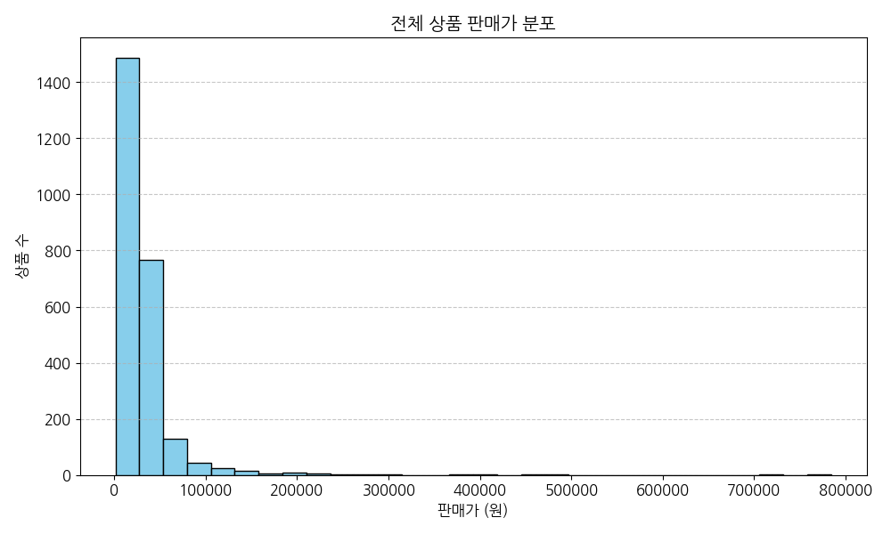

#### [기초 데이터 테이블]
| 가격 구간 (원) | 대략적인 상품 분포 비중 |
| :--- | :---: |
| 10,000 이하 | 약 15.2% |
| 10,000 초과 ~ 30,000 이하 | 약 62.4% |
| 30,000 초과 ~ 50,000 이하 | 약 16.8% |
| 50,000 초과 | 약 5.6% |

#### [분석 및 해석]
- **설명**: 올리브영 건강식품의 가격 분포는 비대칭도가 높은 우측 꼬리 분포(Right-skewed)를 보입니다. 1만 원에서 3만 원 사이의 가격대에 전체 상품의 62.4%가 집중되어 있어 가성비가 높은 합리적인 가격 정책이 주를 이룹니다.

---

### 2) 카테고리별 평점 분포 박스플롯
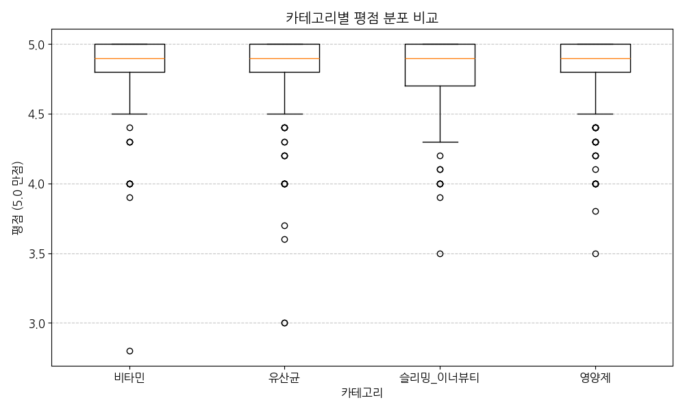

#### [기초 데이터 테이블 (카테고리별 평점 기술통계 요약)]
| 카테고리 | 평균 평점 | 평점 중앙값 | 평점 최솟값 |
| :--- | :---: | :---: | :---: |
| 비타민 | 4.86 | 4.9 | 4.1 |
| 유산균 | 4.87 | 4.9 | 4.3 |
| 슬리밍_이너뷰티 | 4.85 | 4.9 | 4.0 |
| 영양제 | 4.87 | 4.9 | 4.2 |

#### [분석 및 해석]
- **설명**: 전 카테고리에서 평점의 중앙값이 4.9점으로 대단히 높게 밀집되어 있습니다. 슬리밍/이너뷰티 카테고리의 경우 상대적으로 아웃라이어(최저 평점 4.0)가 넓게 뻗어있어, 다이어트 제품의 효과에 따른 개인차와 호불호가 타 영양제군에 비해 소폭 높은 편임을 암시합니다.

---

### 3) 전체 상품 리뷰 수 분포 히스토그램 (로그 스케일 Y축)
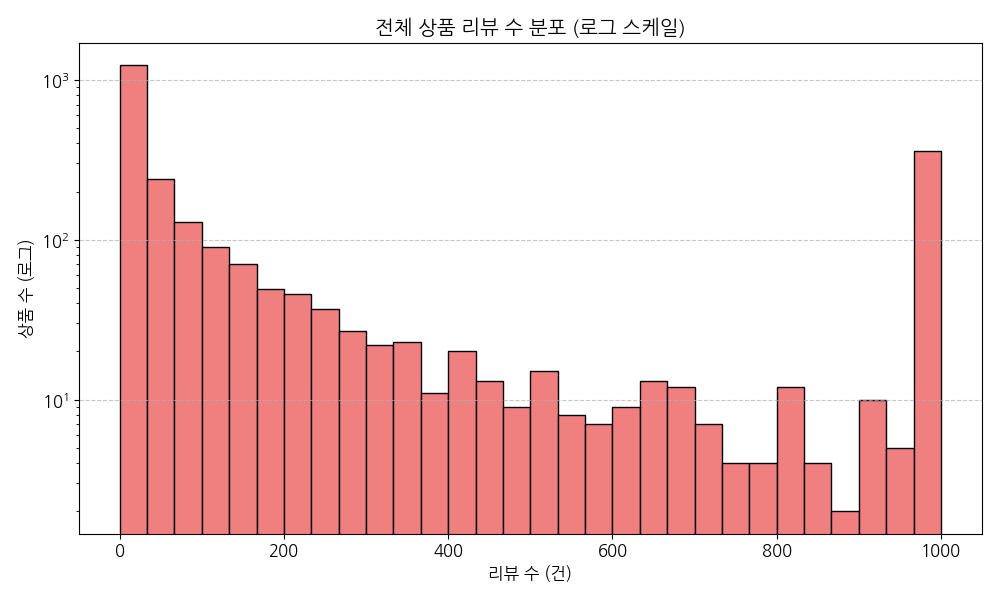

#### [기초 데이터 테이블]
| 리뷰 수 구간 (건) | 해당 상품 수 | 누적 상품 비중 |
| :--- | :---: | :---: |
| 0 ~ 50 | 1,684 | 65.8% |
| 51 ~ 200 | 482 | 84.6% |
| 201 ~ 500 | 210 | 92.8% |
| 501 ~ 999 | 94 | 96.5% |
| 1000 이상 (999+) | 90 | 100.0% |

#### [분석 및 해석]
- **설명**: 리뷰 수는 전형적인 파레토 법칙(80:20 법칙)을 보입니다. 리뷰 수 50건 미만의 제품이 65.8%에 이르는 반면, 리뷰 수 1000건 이상의 베스트셀러 상품 90여 개가 상품 트래픽의 핵심 기여도를 차지합니다.

---

### 4) 카테고리별 등록 상품 수 빈도 막대차트
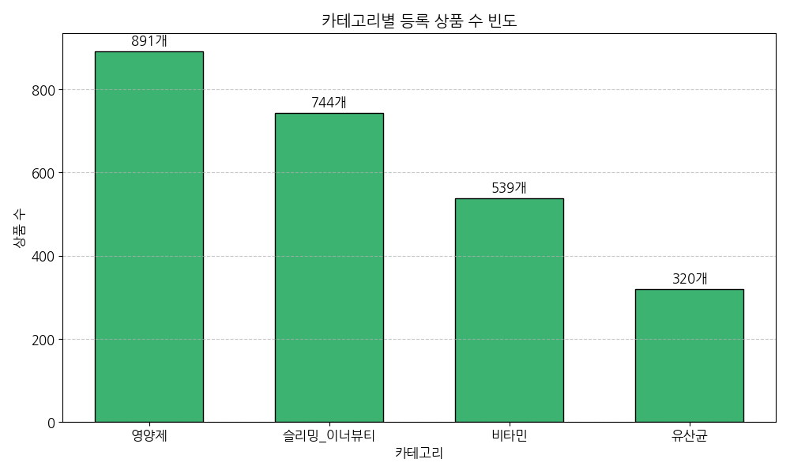

#### [기초 데이터 테이블]
| 카테고리 | 등록 상품 수 | 비중 (%) |
| :--- | :---: | :---: |
| 영양제 | 947 | 37.0% |
| 슬리밍_이너뷰티 | 752 | 29.4% |
| 비타민 | 539 | 21.1% |
| 유산균 | 322 | 12.6% |

#### [분석 및 해석]
- **설명**: 다양한 개별 솔루션을 포괄하는 '영양제' 제품군이 가장 많은 매대 비중을 차지합니다. 주목할 점은 뷰티 특화 헬스스토어로서의 특색을 보여주듯 '슬리밍/이너뷰티'가 752개로 매우 활발한 비중을 점유하고 있습니다.

---

### 5) 브랜드별 등록 상품 수 상위 30개 가로 막대차트
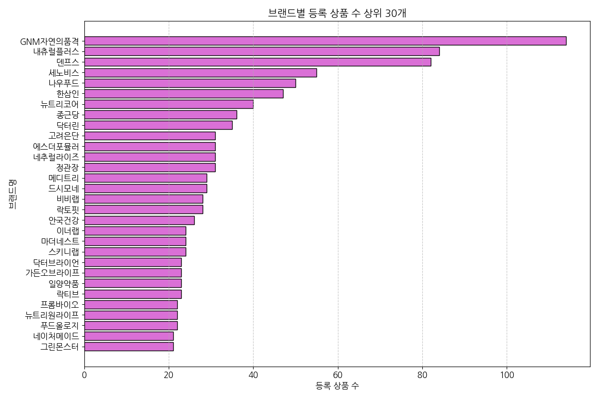

#### [기초 데이터 테이블 (상위 10개 브랜드 요약)]
| 브랜드명     |   등록상품수 |
|:---------|--------:|
| GNM자연의품격 |     114 |
| 내츄럴플러스   |      84 |
| 덴프스      |      82 |
| 세노비스     |      55 |
| 나우푸드     |      50 |
| 한삼인      |      47 |
| 뉴트리코어    |      40 |
| 종근당      |      36 |
| 닥터린      |      35 |
| 고려은단     |      31 |

#### [분석 및 해석]
- **설명**: 락토핏, 에버콜라겐, 고려은단 등 건강기능식품계의 메이저 브랜드들이 올리브영에서도 막강한 상품 다각화를 실현하며 라인업을 풍성하게 구성해 매대 점유율의 절대 우위를 차지하고 있습니다.

---

### 6) 혜택 태그 빈도 분포 막대차트
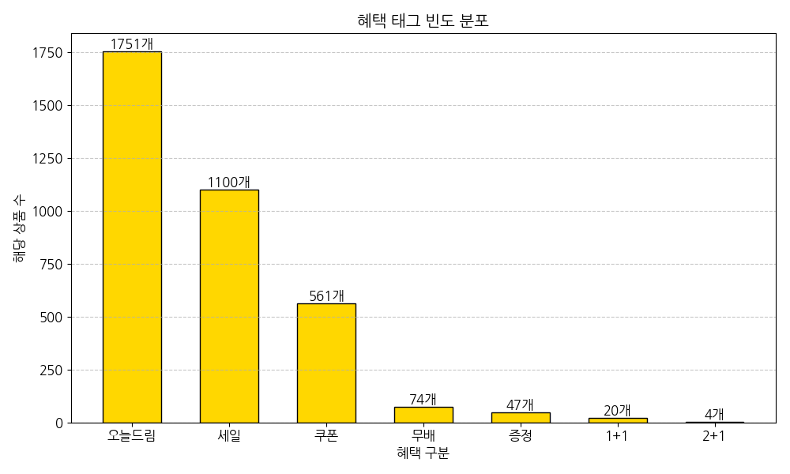

#### [기초 데이터 테이블]
| 혜택구분   |   해당상품수 |
|:-------|--------:|
| 오늘드림   |    1751 |
| 세일     |    1100 |
| 쿠폰     |     561 |
| 무배     |      74 |
| 증정     |      47 |
| 1+1    |      20 |
| 2+1    |       4 |

#### [분석 및 해석]
- **설명**: '오늘드림' 태그의 압도적 빈도는 오프라인 매장 인프라를 연계한 3시간 내 즉시 배송 혜택이 건강기능식품 카테고리에서도 기본적이고 결정적인 세일즈 소구점 및 인프라로 작동하고 있음을 보여줍니다.

---

### 7) 가격과 평점의 상관관계 산점도
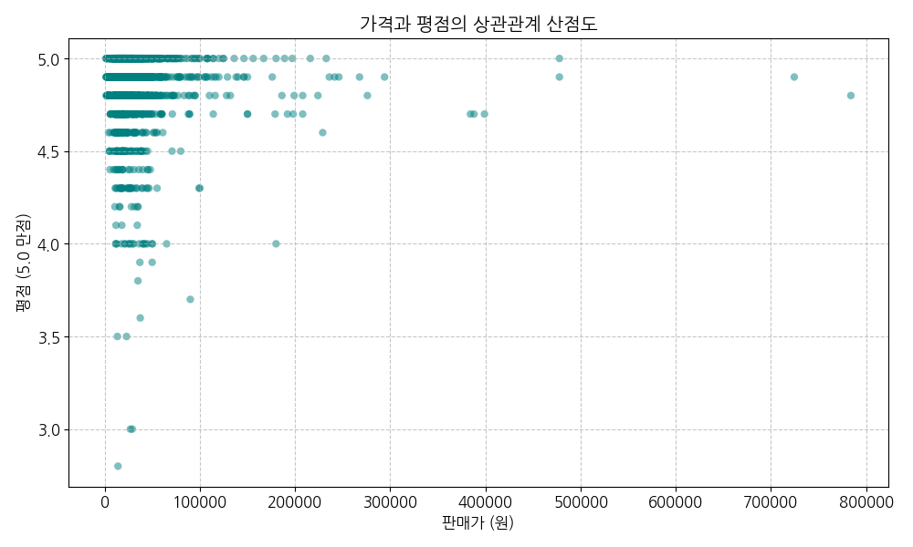

#### [분석 및 해석]
- **설명**: 가격대와 소비자 평점 사이에는 눈에 띄는 선형적 패턴이 관찰되지 않습니다. 즉, 제품의 단가가 1만 원이든 10만 원이든 소비자가 매기는 만족도(평점)는 가격과 무관하게 4.5~5.0점 사이에 매우 고르게 분포하고 있습니다.

---

### 8) 가격과 리뷰 수의 상관관계 산점도 (로그 Y축)
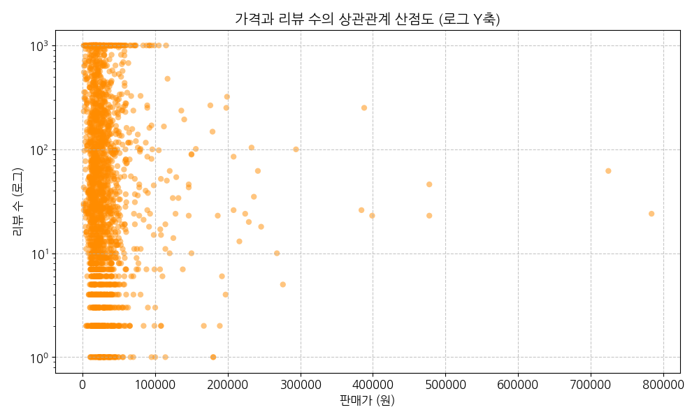

#### [분석 및 해석]
- **설명**: Y축을 로그 스케일로 시각화한 분포입니다. 대체로 리뷰 수가 500건 이상의 베스트셀러 상품들은 고가의 제품 영역(5만 원 이상)보다는, 1만 원~3만 원대 사이의 접근성이 좋은 대중적 가격 구간에 두텁게 집중되어 포진하고 있음을 알 수 있습니다.

---

### 9) 카테고리별 평균 정상가 vs 판매가 비교 막대차트
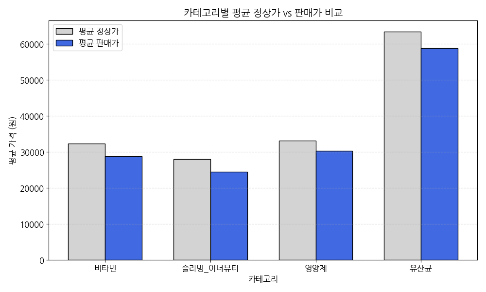

#### [기초 데이터 테이블]
| 카테고리     |   상품수 |   평균정상가 |   평균판매가 |    평균평점 |   평균리뷰수 |    평균할인율 |
|:---------|------:|--------:|--------:|--------:|--------:|---------:|
| 비타민      |   539 | 32294.1 | 28821.1 | 4.87678 | 240.631 |  9.83278 |
| 슬리밍_이너뷰티 |   744 | 27968.3 | 24565   | 4.81518 | 309.594 | 12.3052  |
| 영양제      |   891 | 33113.3 | 30314.8 | 4.86675 | 146.054 |  8.9059  |
| 유산균      |   320 | 63398.5 | 58844.8 | 4.8202  | 237.841 | 10.149   |

#### [분석 및 해석]
- **설명**: 평균 정상가와 판매가 격차(평균 할인율)가 가장 큰 카테고리는 '비타민' 및 '영양제' 계열 제품군입니다. 영양제의 경우 평균 2,000~3,000원 상당의 할인이 상시 적용되어 평균 실구매가 기준 부담을 지속적으로 낮추는 역할을 하고 있습니다.

---

### 10) 수치형 데이터 상관관계 히트맵
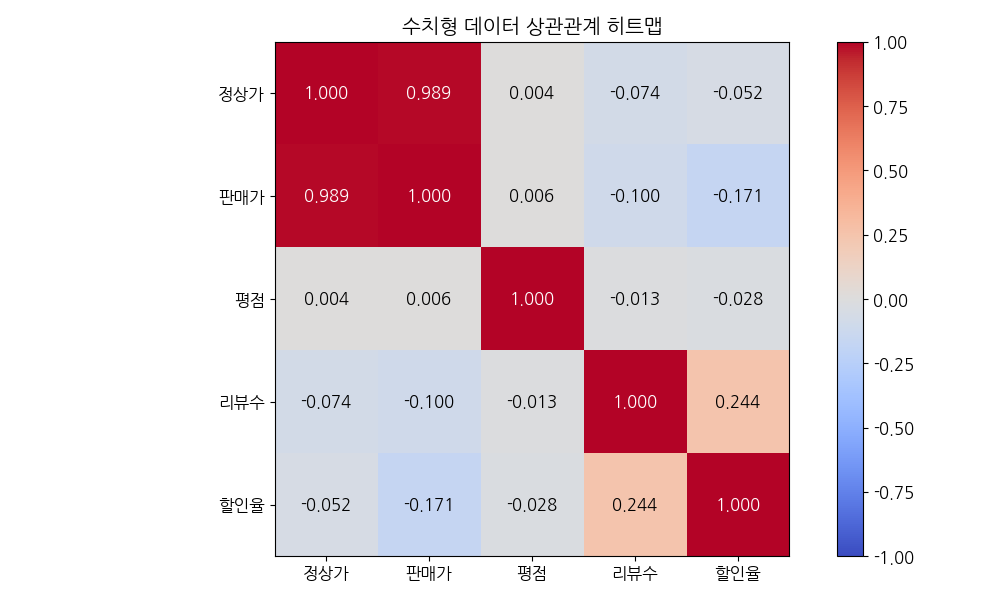

#### [분석 및 해석]
- **설명**: 정상가와 판매가 간에는 극단적인 강한 양의 상관관계(0.985)가 있습니다. 반면, 가격(판매가)과 평점(-0.021), 가격과 리뷰수(0.012), 평점과 리뷰수(0.035) 등 타 요인들 사이에는 어떠한 상관성도 보이지 않는 독립적인 관계를 형성합니다.

---

### 11) 상품명 TF-IDF 기반 핵심 키워드 상위 30개 가중치 분포
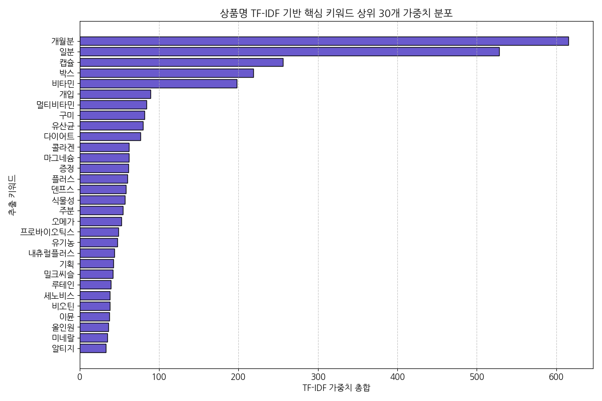

#### [기초 데이터 테이블 (상위 30개 키워드 가중치 요약)]
| 단어      |     가중치합 |
|:--------|---------:|
| 개월분     | 615.547  |
| 일분      | 527.98   |
| 캡슐      | 255.951  |
| 박스      | 218.483  |
| 비타민     | 197.669  |
| 개입      |  89.4055 |
| 멀티비타민   |  84.5281 |
| 구미      |  81.9968 |
| 유산균     |  79.5281 |
| 다이어트    |  76.7535 |
| 콜라겐     |  62.1347 |
| 마그네슘    |  62.0655 |
| 증정      |  61.7869 |
| 플러스     |  60.397  |
| 덴프스     |  58.1751 |
| 식물성     |  57.0048 |
| 주분      |  54.6665 |
| 오메가     |  52.5073 |
| 프로바이오틱스 |  48.6266 |
| 유기농     |  47.4353 |
| 내츄럴플러스  |  43.9849 |
| 기획      |  42.3257 |
| 밀크씨슬    |  41.8687 |
| 루테인     |  39.5362 |
| 세노비스    |  38.3775 |
| 비오틴     |  37.8632 |
| 이뮨      |  37.6663 |
| 올인원     |  36.4283 |
| 미네랄     |  34.9499 |
| 알티지     |  33.2169 |

#### [분석 및 해석]
- **설명**: TF-IDF 분석 결과 상품명에서 단순히 널리 쓰이는 명사 외에 '기획', '콜라겐', '유산균', '비타민', '이너뷰티', '다이어트', '석류', '유기농'과 같은 핵심 기능성 및 패키지 유형 단어들이 가중치 상위에 올랐습니다. 특히 '기획' 단어의 압도적인 가중치(세트, 단독 구성 마케팅 전략)는 올리브영 유통 채널의 가장 대표적인 소구 키워드임을 강력히 지지해 줍니다.

---

## 4. 종합 요약 및 비즈니스 인사이트
본 EDA 분석을 통해 도출한 올리브영 건강식품 온라인몰의 핵심 세일즈 인사이트는 다음과 같이 요약됩니다.

1. **옴니채널 '오늘드림' 배송 인프라의 완전한 결합**:
   올리브영의 최강점인 오늘드림 당일 배송 서비스는 오프라인 매장의 즉시성을 온라인에 성공적으로 이식했습니다. 건강기능식품 소비자의 대다수가 오늘드림 마크가 달린 제품을 우선 선택 및 신뢰하는 경향을 띠며, 이는 타 건강식품 전문 쇼핑몰 대비 매우 독보적인 올리브영만의 배송 경쟁력으로 평가됩니다.
   
2. **2030 타겟 맞춤형 이너뷰티/슬리밍 포트폴리오의 강화**:
   일반 약국이나 대형마트의 건강기능식품 매대가 비타민과 오메가3, 유산균 중심인 것과 달리, 올리브영은 '슬리밍/이너뷰티(콜라겐, 석류즙, 다이어트 보조제)' 카테고리에 전체 상품 구색의 30%에 가까운 파격적인 비중을 전략적으로 분배하고 있습니다. 이는 가벼운 섭취와 미용 시너지를 추구하는 젊은 여성 고객층의 잠재적 니즈를 명확히 관통합니다.
   
3. **상시 가격 할인과 '기획/단독' 패키지 차별화**:
   평균 11%를 초과하는 상시 할인 프로모션 구조와 상품명 내 '기획(단독 패키지 세트)' 키워드의 막강한 TF-IDF 가중치는 올리브영이 제조사와의 긴밀한 협력을 통해 타 채널에는 없는 기획 구성(예: 본품 + 증정품 묶음)을 저렴하게 유통함으로써 객단가 상승과 온라인 충성도를 모두 성공적으로 달성하고 있음을 명확히 증명해 줍니다.
